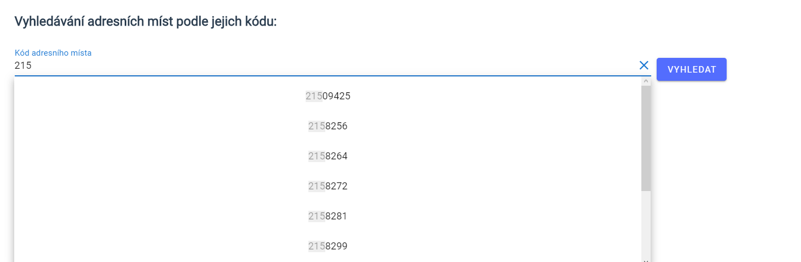

# Uživatelská dokumentace
V této dokumentaci je popsáno, co je možné v aplikaci provádět a jak. Jsou zde uvedeny konkrétní příklady užití. Aplikace je dostupná na adrese [https://hledání.rúian.opendata.cz](https://hledání.rúian.opendata.cz).

## O aplikaci
Aplikace slouží k vyhledávání adresních míst v Registru územní identifikace, adres a nemovitostí (RÚIAN).

## Vyhledávání adresních míst
Adresní místa lze vyhledávat podle jejich adresy, nebo podle jejich kódu.

### Vyhledávání podle adresy
Vyhledávání lze provádět pomocí formuláře. Položky formuláře:
- obec
- část obce
- ulice
- číslo domovní/orientační.

Pro jednotlivé položky je dostupné našeptávání. Našeptávání napovídá na základě vyplněných položek, které jsou ve formuláři výše. Např. našeptávání pro ulici je závislé na položkách *obec* a *část obce*. Není nutné vyplňovat celý formulář. Všechny položky jsou nepovinné. Údaje je nutné vyplňovat s diakritikou. Výsledky vyhledávání jsou dostupné v tabulce na konci stránky. Jakmile se načtou výsledky, pod tlačítkem **Vyhledat** se zobrazí odkaz **Přejít na výsledky**, pomocí kterého je možné posunout stránku na výsledky.

Příklad vyhledávání podle adresy:
```
Obec: Praha
Část obce: Nové město
Ulice: Národní
Číslo domovní/orientační: 36
```


### Vyhledávání podle kódu
Pro vyhledávání podle kódu je také dostupné našeptávání. Vybráním položky v našeptávači dojde k přesměrování na detail adresního místa.

Příklad vyhledávání podle kódu:


### Ukázky našeptávání
Našeptávání pro část obce


Našeptávání kódu adresního místa



## Zobrazení detailu adresního místa
K detailu adresního místa je možné se dostat skrze odkaz v tabulce s výsledky vyhledávání, nebo zvolením položky v našeptávačí pro vyhledávání podle kódu adresního místa. Ve vyhledávání adresních míst v okolí je odkaz na detail dostupný po kliknutí na značku na mapě. Detail obsahuje informace o adresním místě, jeho adresu dle vyhlášky č. 359/2011 Sb. Detail také obsahuje mapu, na které je zobrazeno adresní místo a odkazy na známé mapové služby, ve kterých je možné si adresní místo zobrazit.

Odkaz na detail ve vyhledávání adresních místv okolí


Ukázka detailu adresního místa

[Odkaz na detail](https://hledání.rúian.opendata.cz/adresni-mista/28344987)


## Zobrazení adresního místa ve známých mapových službách
V detailu adresního místa jsou dostupné odkazy na známé mapové služby, konkrétně se jedná o služby Google Maps, Mapy.cz a OpemStreetMap. Po kliknutí na odkaz se v nové záložce otevře daná služba, ve které bude zobrazeno adresní místo.

## Vyhledání adresních míst v okolí
Součastí aplikace je vyhledávání adresních míst v okolí, ke kterému je možné se dostat skrze navigaci. Pokud povolíte sdílení polohy, zobrazí se na mapě adresní místa ve vašem okolí. Pokud jste na počítači, může být zjištění vaší polohy nepřesné, jelikož většina počítačů nemá GPS. Dále je možné manuálně zadat GPS souřadnice bodu, jehož okolí si přejete zobrazit. Souřadnice je třeba zadat v desítkové soustavě, nikoliv ve stupních. Na mapě jsou adresní místa vyznačena značkami. Po kliknutí na značku se zobrazí adresa adresního místa a odkaz na jeho detail.
Součastí aplikace je vyhledávání adresních míst v okolí, ke kterému je možné se dostat skrze navigaci. Pokud povolíte sdílení polohy, zobrazí se na mapě adresní místa ve vašem okolí. Pokud jste na počítači, může být zjištění vaší polohy nepřesné, jelikož většina počítačů nemá GPS. Dále je možné manuálně zadat GPS souřadnice bodu, jehož okolí si přejete zobrazit. Souřadnice je třeba zadat v desítkové soustavě, nikoliv ve stupních. Na mapě jsou adresní místa vyznačena značkami. Po kliknutí na značku se zobrazí adresa adresního místa a odkaz na jeho detail.

Příklad vyhledávání adresních míst v okolí:
```
x: 50.10486228537393
y: 14.390164508810418
```

